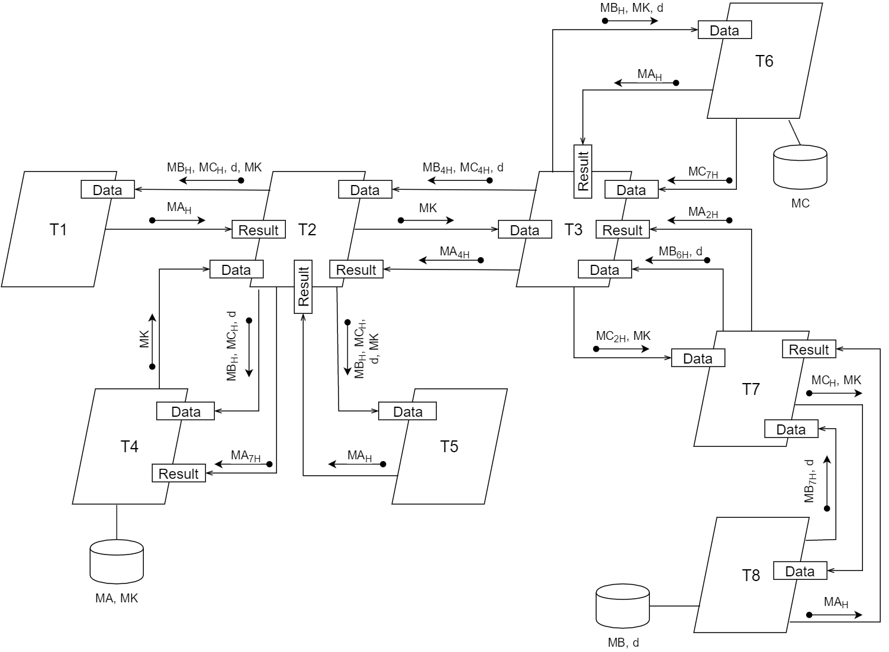

# Task 3. Rendezvous synchronization

1. Given the PC/RAM architecture: 

   

2. Task to calculate: MA = MB * d + MC * MC
    - MA, MB, MC, MK: Matrix
    - d: Integer
3. Programming language: Ada
    - Thread communication means: rendezvous mechanism

---

# Solution

### 1. Parallel mathematical algorithm:

1. MAh = MBh * d + MCh * MK

### 2. Developing the algorithm for each thread

##### Thread T1 and T5
1. Accept MBh , MCh , d and MK from T2
2. Calculate MAh = MBh * d + MCh * MK
3. Send MAh to T2

 

##### Thread T2
1. Accept MB4h , MC4h and d from T3
2. Accept MK from T4
3. Send MBh , MCh, d and MK to T1 T4 and T5
4. Send MK to T3
5. Calculate MAh = MBh * d + MCh * MK
6. Accept MAh from T1 and T5
7. Accept MA4h from T3
8. Send MA7h to T4

 

##### Thread T3
1. Accept MB6h and d from T7
2. Send MBh and d to T6
3. Send MB4h and d to T2
4. Accept MC7h from T6
5. Send MC2h to T7
6. Send MC4h to T2
7. Accept MK from T2
8. Send MK to T6
9. Send MK to T7
10. Calculate MAh = MBh * d + MCh * MK
11. Accept MAh from T6
12. Accept MA2h from T7
13. Send MA4h to T2

 

##### Thread T4
1. Input MK
2. Send MK to T2
3. Accept MBh , d, MCh from T2
4. Calculate MAh = MBh * d + MCh * MK
5. Accept MA7h from T2
6. Output MA

 

##### Thread T6
1. Input MC
2. Send MC7h to T3
3. Accept MBh , d and MK from T3
4. Calculate MAh = MBh * d + MCh * MK
5. Send MAh to T3

 

##### Thread T7
1. Accept MB7h and d from T8
2. Accept MC2h and MK from T3
3. Send MB6h and d to T3
4. Send MCh and MK to T8
5. Calculate MAh = MBh * d + MCh * MK
6. Accept MAh from T8
7. Send MA2h to T3

 

##### Thread T8
1. Input MB, d
2. Send MB7h and d to T7
3. Accept MCh and MK from T7
4. Calculate MAh = MBh * d + MCh * MK
5. Send MAh to T7

### 3. Schema of the thread interaction:

   

### 4. [Code listing](./solution.adb)